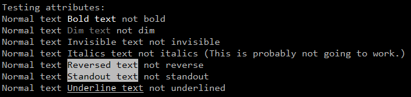
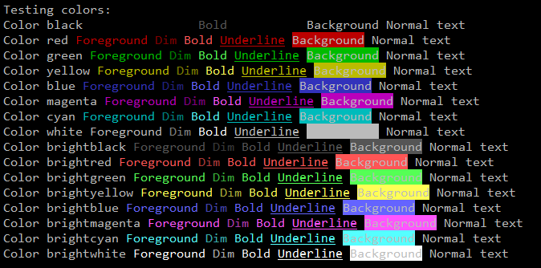
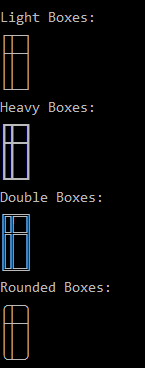

# Bash Terminal Library

A library to simplify working with the terminal in bash.

* [Project TODO](#project-todo)
* [Requirements](#requirements)
* [Overview](#overview)
* [Why?](#why)
* [Terminal Attributes - `attr.sh`](#terminal-attributes---attrsh)
  * [Primary interface](#primary-interface)
  * [Shortcuts](#shortcuts)
  * [Internal variables](#internal-variables)
* [Terminal Colors - `color.sh`](#terminal-colors---colorsh)
  * [Primary interface](#primary-interface-1)
  * [Shortcuts](#shortcuts-1)
  * [Colors](#colors)
  * [Internal variables](#internal-variables-1)
* [Terminal Cursor movement - `cursor.sh`](#terminal-cursor-movement---cursorsh)
  * [Primary interface](#primary-interface-2)
  * [Functions](#functions)
  * [Shortcuts](#shortcuts-2)
  * [Internal variables](#internal-variables-2)
* [Box drawing unicode characters - `boxes.sh`](#box-drawing-unicode-characters---boxessh)
  * [Primary interface](#primary-interface-3)
  * [Variable meaning](#variable-meaning)
* [Functional Interface - `functions.sh`](#functional-interface---functionssh)
* [Export - `export.sh`](#export---exportsh)
  * [Usage](#usage)
* [Examples](#examples)
  * [Attributes - `test_attr.sh`](#attributes---test_attrsh)
  * [Colors - `test_color.sh`](#colors---test_colorsh)
  * [Boxes - `test_boxes.sh`](#boxes---test_boxessh)
* [Reference](#reference)
* [Other Projects](#other-projects)
* [LICENSE](#license)

## Project TODO

* Spinners.
  * <https://stackoverflow.com/questions/2685435/cooler-ascii-spinners>
  * <https://github.com/Silejonu/bash_loading_animations/blob/main/bash_loading_animations.sh>

## Requirements

This library requires Bash 4.
There are some features that only work with 4.
For example Unicode characters `$'\u2500'` and associative arrays.

MacOS still ships with Bash 3.
For MacOS check out [Homebrew](https://brew.sh/)

## Overview

This library provides a variable interface.
When the library loads it calls `tput` to get the escape codes for terminal functionality.

The primary interface is using associative arrays.
For example the following will draw the word `Underline` underlined.
In this example the associative array `$TERM_ATTR` contains escape codes for setting terminal attributes.

```shell
source "./attr.sh"
echo "Normal ${TERM_ATTR[underline]}Underline${TERM_ATTR[UNDERLINE]} not underlined"
```

There are also shortcuts variables.
For example the following will draw the word `Bold` in bold.
Instead of using the associative array this uses variables just for those attributes.

```shell
source "./attr.sh"
echo "Normal ${TERM_ATTR_BOLD}Bold${TERM_ATTR_RESET} not bold"
```

This us done by using the command `tput` to generate the escape codes.
First the associative arrays are built.
Then the shortcut variables are created.
See the file `attr.sh` for more details.

## Why?

Because there isn't a simple solution out there that can be easily customized for a project.
There are more complicated libraries that don't cover many cases.
And plenty of snippets and Gists.
But nothing with broad coverage that is easy to use.
I created this after having to dig up all of this for a simple world clock.

The goal is not to provide an all encompassing library that solves all of your problems.

The goal is to make something simple that can be easily customized to suit YOUR needs.

To that end I recommend picking and choosing the bits and pieces you want in your script.

## Terminal Attributes - `attr.sh`

Escape codes for setting various terminal attributes.
For example setting text **BOLD**.

### Primary interface

The primary interface for the attributes library is the associative array `$TERM_ATTR`.

```shell
declare -A TERM_ATTR    # Stores terminal attribute escape sequences.
```

### Shortcuts

Shortcut variables to make code a bit more friendly.

| Variable | Attribute | Name | Meaning |
| --- | --- | --- | --- |
| TERM_ATTR_BOLD | bold | enter_bold_mode | turn on bold (extra bright) mode |
| TERM_ATTR_CLEAR | clear | clear_screen | clear screen and home cursor |
| TERM_ATTR_DIM | dim | enter_dim_mode | turn on half-bright mode |
| TERM_ATTR_EXIT_ITALICS | ritm | exit_italics_mode | End italic mode |
| TERM_ATTR_EXIT_STANDOUT | rmso | exit_standout_mode | exit standout mode |
| TERM_ATTR_EXIT_UNDERLINE | rmul | exit_underline_mode | exit underline mode |
| TERM_ATTR_ITALICS | sitm | enter_italics_mode | Enter italic mode |
| TERM_ATTR_ORIG | op | orig_pair | Set default pair to its original value |
| TERM_ATTR_RESET | sgr0 | exit_attribute_mode | turn off all attributes |
| TERM_ATTR_REVERSE | rev | enter_reverse_mode | turn on reverse video mode |
| TERM_ATTR_STANDOUT | smso | enter_standout_mode | begin standout mode |
| TERM_ATTR_UNDERLINE | smul | enter_underline_mode | begin underline mode |

The `Variable` column is the variable name from the terminfo manpage.

### Internal variables

Variables used to build the associative array.
Change these to customize the escape codes retrieved using `tput`.

* `$_TERM_ATTRIBUTES` -
  The attributes to fetch escape codes for.
  This associative array contains the capability name and attribute from the terminfo manpage.
  When this array is processed both the capability name and attribute are set in `$TERM_ATTR`

* `$_TERM_ATTRIBUTE_ALIASES` -
  Aliases to add to the TERM_ATTR array.
  These are more friendly names for the various capabilities.
  For example use `UNDERLINE` to exit underline mode instead of the more cryptic `rmul`.

## Terminal Colors - `color.sh`

Escape codes for setting foreground and background.

This only uses the old 8 color interface.

**IMPORTANT:**
The default foreground and background colors are **NOT** always the same as `white` and `black`.
To get the default foreground and background colors use `$TERM_ATTR_ORIG` from `attr.sh`.

### Primary interface

The primary interface for the color library are the associative arrays `$TERM_FG` and `$TERM_BG`.

```shell
declare -A TERM_FG      # Stores terminal foreground color escape sequences.
declare -A TERM_BG      # Stores terminal background color escape sequences.
```

### Shortcuts

Shortcut variables to make code a bit more friendly.

| Variable | Color |
| --- | --- |
| TERM_FG_BLACK | black  foreground |
| TERM_FG_RED | red  foreground |
| TERM_FG_GREEN | green  foreground |
| TERM_FG_YELLOW | yellow  foreground |
| TERM_FG_BLUE | blue  foreground |
| TERM_FG_MAGENTA | magenta  foreground |
| TERM_FG_CYAN | cyan  foreground |
| TERM_FG_WHITE | white background |
| TERM_BG_BLACK | black background |
| TERM_BG_RED | red background |
| TERM_BG_GREEN | green background |
| TERM_BG_YELLOW | yellow background |
| TERM_BG_BLUE | blue background |
| TERM_BG_MAGENTA | magenta background |
| TERM_BG_CYAN | cyan background |
| TERM_BG_WHITE | white background |

### Colors

Supported colors.

| Color | Number |
| --- | --- |
| black | 0 |
| red | 1 |
| green | 2 |
| yellow | 3 |
| blue | 4 |
| magenta | 5 |
| cyan | 6 |
| white | 7 |

Note that on some terminals red and blue may be swapped.

### Internal variables

Variables used to build the associative arrays.

* `$_TERM_COLORS` -
  All available colors index by the color number.
  When this array is processed both the color name and color number are set in the arrays `$TERM_FG` and `$TERM_BG`.

## Terminal Cursor movement - `cursor.sh`

### Primary interface

The primary interface for the cursor library is the associative array `$TERM_CURSOR`.

```shell
declare -A TERM_CURSOR  # Stores terminal cursor escape sequences.
```

### Functions

The following are functions because they call tput dynamically or return values.

Fetching the cursor position is a bit of a hack.
This is a known issue with multiple solutions.
I used one that should be portable with modern Bash.

* `term::move()` -
  Move the cursor to an row and column position.

* `term::pos()` -
  Report the cursor position. row;col

* `term::row()` -
  Report the cursor row.

* `term::col()` -
  Report the cursor column.

* `term::cols()` -
  Report the number of columns the terminal has.

* `term::lines()` -
  Report the number of lines the terminal has.

### Shortcuts

Shortcut variables to make code a bit more friendly.

| Variable | Attribute | Name | Meaning |
| --- | --- | --- | --- |
| TERM_CURSOR_CLR_BOL | el1 | clr_bol | Clear to beginning of line |
| TERM_CURSOR_CLR_EOL | el | clr_eol | clear to end of line |
| TERM_CURSOR_CLR_EOS | ed | clr_eos | clear to end of screen |
| TERM_CURSOR_DELETE_CHAR | dch1 | delete_character | delete character |
| TERM_CURSOR_DELETE_LINE | dl1 | delete_line | delete line |
| TERM_CURSOR_DOWN | cud1 | down | down one line |
| TERM_CURSOR_HIDE | civis | hide | make cursor invisible |
| TERM_CURSOR_HOME | home | home | home cursor (if no cup) |
| TERM_CURSOR_INSERT_CHAR | ich1 | insert_character | insert character |
| TERM_CURSOR_INSERT_LINE | il1 | insert_line | insert line |
| TERM_CURSOR_INVISIBLE | civis | invisible | make cursor invisible |
| TERM_CURSOR_LEFT | cub1 | left | move left one space |
| TERM_CURSOR_NORMAL | cnorm | normal | make cursor appear normal (undo civis/cvvis) |
| TERM_CURSOR_RESTORE | rc | restore | restore cursor to position of last |
| TERM_CURSOR_RIGHT | cuf1 | right | non-destructive space (move right one space) |
| TERM_CURSOR_SAVE | sc | save | save current cursor |
| TERM_CURSOR_SHOW | cvvis | show | make cursor very visible |
| TERM_CURSOR_TO_LL | ll | to_ll | last line, first column (if no cup) |
| TERM_CURSOR_UP | cuu1 | up | up one line |
| TERM_CURSOR_VISIBLE | cvvis | visible | make cursor very visible |

### Internal variables

Variables used to build the associative array.
Change these to customize the escape codes retrieved using `tput`.

* `$_TERM_CURSOR_ATTRIBUTES` -
  The attributes to fetch escape codes for.
  These are taken directly from the `terminfo` man page.
  When this array is processed both the capability name and attribute are set in `$TERM_CURSOR`.

## Box drawing unicode characters - `boxes.sh`

Unicode box drawing characters.

I created a custom naming scheme to make drawing boxes a little easier.
This is a bit odd, but it kinda makes sense if you squint.

There are two additional files:

* `all_boxes.sh` - All Unicode box drawing characters with long names from the Unicode standard.
* `alt_boxes.sh` - The same thing, but shorter names.

### Primary interface

The primary interface for the boxes library is the associative array `$TERM_BOX`.
There are no shortcuts for this library.

```shell
declare -A TERM_BOX     # Stores unicode box drawing characters.
```

### Variable meaning

Each of the box characters has a name that indicates the type of line then the position in the box.

For example the name `L_MC` means Light line, Middle and Center position, `┼`.

This is what I came up with to make drawing boxes a little easier.

The first character indicates the type.
Rounded is the same as Light, but the corners are rounded.

| Character | Line type   | Examples |
| --------- | ----------- | -------- |
| L         | Light       | `│┐┘┌└`  |
| H         | Heavy       | `┃┓┛┏┗`  |
| D         | Double line | `║╗╝╔╚`  |
| R         | Rounded     | `│╮╯╭╰`  |

These two are just lines in the given orientation.

* `L_LH` - Light Line Horizontal `─`
* `H_LV` - Heavy Line Vertical   `┃`

For the box parts the second two characters indicate the position.

* The first characters is th vertical orientation. \
  T = Top,  M = Middle, B = Bottom
* The second character is the horizontal orientation. \
  L = Left, C = Center, R = Right

Examples of box parts.

| Line Type  | VAR  | Meaning         | Var  | Meaning           | Var  | Meaning          |
| ---------- | ---- | --------------- | ---- | ----------------- | ---- | ---------------- |
| Light      | L_TL |    Top Left `┌` | L_TC |    Top Center `┬` | L_TR |    Top Right `┐` |
| Heavy      | H_ML | Middle Left `┣` | H_MC | Middle Center `╋` | H_MR | Middle Right `┫` |
| Double     | D_BL | Bottom Left `╚` | D_BC | Bottom Center `╩` | D_BR | Bottom Right `╝` |
| Rounded    | R_BL | Bottom Left `╰` | R_BC | Bottom Center `┴` | R_BR | Bottom Right `╯` |

## Functional Interface - `functions.sh`

Think of this as a little bonus.
It is just functions to print the various escape codes.
This is more a suggestion instead of something to use directly.

## Export - `export.sh`

This script will print variable declarations that Bash can read back.
All of the environment variables for the above libraries are output.
**Note: functions are not included!*

This is really only useful for adding the escape codes for a specific terminal directly to your script.

### Usage

Run the script and redirect the output.
Optionally set the environment variable `$TERM`.

```shell
TERM=xterm ./export.sh > env_xterm.sh
```

## Examples

Here is some example output of the various test scripts.
These were captured using Putty on Windows using the [Consolas font](https://en.wikipedia.org/wiki/Consolas).
The only change in Putty was to make Blue readable.

### Attributes - `test_attr.sh`

Exercises te attributes for Underline, Dim and Bold.



### Colors - `test_color.sh`

Demonstrates the colors, including with the attributes Dim, Bold and Underline.



### Boxes - `test_boxes.sh`

Draws a few boxes.



## Reference

Most of the details in these files have come from Google searches and the `terminfo` manpage.

`terminfo` man page:

* `man 5 terminfo`
* <https://man7.org/linux/man-pages/man5/terminfo.5.html>

`tput` man page:

* `man 5 tput`
* <https://man7.org/linux/man-pages/man1/tput.1.html>

Unicode Box drawing characters:

* <https://www.compart.com/en/unicode/block/U+2500>
* <https://en.wikipedia.org/wiki/Box-drawing_characters>

## Other Projects

Other projects out there that would be interesting to look at.

I have not tried any of these.
I browsed through them to get some ideas.

* <https://github.com/timo-reymann/bash-tui-toolkit> \
  **Toolkit to create interactive and shiny terminal UIs using plain bash builtins** \
  Uses hardcoded escape sequences

* <https://github.com/fidian/ansi> \
  **This bash script will generate the proper ANSI escape sequences to move the cursor around the screen, make text bold, add colors and do much more. It is designed to help you colorize words and bits of text.** \
  Similar concept to this in a single library. \
  Uses hardcoded escape sequences

* <https://github.com/dylanaraps/writing-a-tui-in-bash> \
   **Through my travels I've discovered it's possible to write a fully functional Terminal User Interface in BASH. The object of this guide is to document and teach the concepts in a simple way. To my knowledge they aren't documented anywhere so this is essential.** \
  Uses hardcoded escape sequences

* <https://en.wikibooks.org/wiki/Bash_Shell_Scripting/Whiptail> \
  Whiptail, dialog, and some other options are out there that probably do what you want.

* <https://boxes.thomasjensen.com/> \
  **Boxes is a command line program which draws, removes, and repairs ASCII art boxes.** \
  It draws boxes around text.

* <https://github.com/bhavanki/abom> \
  **A TUI (text UI) framework for bash.** \
  Uses hardcoded escape sequences

* <https://github.com/gavinlyonsrepo/bashmultitool> \
  **A Bash Shell library file for commonly used functions can be imported into shell scripts to create functional and colorful scripts and Terminal users interfaces(TUI). The library allows user to redefine commonly used functions every time you write a shell script, the library may save a part of the development time.** \
  Looks rather useful. Does much more than this library.
  Uses hardcoded escape sequences

* <https://github.com/Silejonu/bash_loading_animations> \
  **Ready-to-use loading animations in ASCII and UTF-8 for easy integration into your Bash scripts.**

## LICENSE

[CC0 1.0 Universal](https://creativecommons.org/publicdomain/zero/1.0/)

See the file `LICENSE` for details.

BashTerm - Bash Terminal Library
Written in 2025 by Jessica K McIntosh AT gmail
To the extent possible under law, the author(s) have dedicated all copyright
and related and neighboring rights to this software to the public domain
worldwide. This software is distributed without any warranty.

You should have received a copy of the CC0 Public Domain Dedication along
with this software.
If not, see <http://creativecommons.org/publicdomain/zero/1.0/>.
