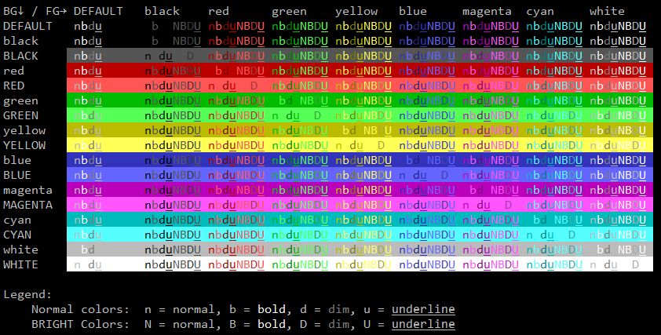

# Bash Terminal Library

A library to simplify working with the terminal in bash.

* [Overview](#overview)
* [Why?](#why)
* [Requirements](#requirements)
* [How](#how)
* [TODO](#todo)
* [Libraries](#libraries)
  * [`attr.sh` - Terminal Attributes](#attrsh---terminal-attributes)
  * [`color.sh` - Terminal Colors](#colorsh---terminal-colors)
  * [`cursor.sh` - Terminal Cursor movement](#cursorsh---terminal-cursor-movement)
  * [`log.sh` - Logging](#logsh---logging)
  * [`menu.sh` - Interactive Menu](#menush---interactive-menu)
  * [`printf.sh` and `printf.awk` - Printf](#printfsh-and-printfawk---printf)
  * [`spinner.sh` - Spinner](#spinnersh---spinner)
  * [`boxes.sh` - Box drawing Unicode characters](#boxessh---box-drawing-unicode-characters)
  * [`function.sh` - Functional Interface](#functionsh---functional-interface)
* [Utilities](#utilities)
  * [`demo.sh` - Demonstrate the Library](#demosh---demonstrate-the-library)
  * [`run_tests.sh` - Unit Tests](#run_testssh---unit-tests)
  * [`src/make.sh` - Create the main files](#srcmakesh---create-the-main-files)
* [Examples](#examples)
  * [`examples/attr_example.sh` - Attributes](#examplesattr_examplesh---attributes)
  * [`examples/boxes_example.sh` - Boxes](#examplesboxes_examplesh---boxes)
  * [`examples/color_example.sh` - Colors](#examplescolor_examplesh---colors)
  * [`examples/cursor_example.sh` - Cursor](#examplescursor_examplesh---cursor)
  * [`examples/export.sh` - Export](#examplesexportsh---export)
  * [`examples/function_example.sh` - Function](#examplesfunction_examplesh---function)
  * [`./examples/log_example.sh` - Logging](#exampleslog_examplesh---logging)
  * [`./examples/menu_example.sh` - Menu](#examplesmenu_examplesh---menu)
  * [`./examples/printf_example.sh` - Printf](#examplesprintf_examplesh---printf)
  * [`examples/spinner_example.sh` - Spinner](#examplesspinner_examplesh---spinner)
  * [`examples/table.sh` - Color and Attribute Table](#examplestablesh---color-and-attribute-table)
  * [Usage](#usage)
* [Reference](#reference)
* [Other Projects](#other-projects)
* [LICENSE](#license)

## Overview

This library provides a terminal interface for Bash using variables and a few functions.

The primary interface is using associative arrays.
For example the following will draw the word `Underline` underlined.
In this example the associative array `$TERM_ATTR` contains escape codes for setting terminal attributes.

```shell
source "./attr.sh"
echo "Normal ${TERM_ATTR[underline]}Underline${TERM_ATTR[UNDERLINE]} not underlined"
```

There are also shortcuts variables.
For example the following will draw the word `Bold` in bold.
Instead of using the associative array this uses variables just for those attributes.

```shell
source "./attr.sh"
echo "Normal ${TERM_BOLD}Bold${TERM_RESET} not bold"
```

This us done by using the command `tput` to generate the escape codes when the library files load.
First the associative arrays are built.
hen the shortcut variables are created.
See the file `attr.sh` for more details.

## Why?

Because there isn't a simple solution out there that can be easily customized for a project.
There are more complicated libraries that don't cover many cases.
And plenty of snippets and Gists.
But nothing with broad coverage that is easy to use.
I created this after having to dig up some of this for a simple world clock.
I had to find the attributes, colors, and box characters separately.

The goal is not to provide an all encompassing library that solves all of your problems.

The goal is to make something simple that can be easily customized to suit YOUR needs.

To that end I recommend picking and choosing the bits and pieces you want in your script.

Don't like how something is named? Change it! \
Don't need attribute aliases? Don't include the code. \
Don't care about drawing boxes? Delete all of the boxy stuff.

## Requirements

This library requires Bash 4.
There are some features that only work with 4.
For example Unicode characters `$'\u2500'` and associative arrays.

MacOS still ships with Bash 3.
For MacOS check out [Homebrew](https://brew.sh/) for a modern version of bash.

AWK is used by the printf library and the script `examples/spinner_example.sh`.

## How

You can certainly source the files in the current directory.
See the files in the directory `examples/` for details.
It would be better to get the raw files from `src/raw_*.sh`.
These files contain the useful bits without the nonsense about loading libraries.
Just copy the contents of the raw file that you need into your script.
The script `demo.sh` presents a menu to run various examples.

## TODO

* Missing screenshots.
* Draw boxes. Could do this with AWK. `examples/draw.sh`
* Unit tests. **In progress.**
* Document `menu.sh`.
* Document `log.sh`.
* Write an actual test for the cursor library.
* Make the library files actual library files.
  Move the contents to a separate file in a separate directory.
  Generate the files in the main directory by adding the header.
  Kinda like having a template.
  This would also allow creating completely standalone scripts from the separate files.
* More spinner frames.

## Libraries

### `attr.sh` - Terminal Attributes

Escape codes for setting various terminal attributes.
For example setting text **BOLD**.

Details in the file [attr.md](doc/attr.md).

### `color.sh` - Terminal Colors

Escape codes for setting foreground and background.

This only uses the old 16 color interface.

Details in the file [color.md](doc/color.md).

### `cursor.sh` - Terminal Cursor movement

Escape codes and functions for working with the cursor.

Details in the file [cursor.md](doc/cursor.md)

### `log.sh` - Logging

Fancy logging, with color!

Details in the file [log.md](doc/log.md)

### `menu.sh` - Interactive Menu

Creates interactive menus.

Details in the file [menu.md](doc/menu.md)

### `printf.sh` and `printf.awk` - Printf

This is a custom implementation of printf in AWK.
With the ability to set attributes and call `tput`.

Details in the file [printf.md](doc/printf.md)

### `spinner.sh` - Spinner

A simple spinner to tell the user something is going on.
This is more of an example than a complete solution.

Details in the file [spinner.md](doc/spinner.md)

### `boxes.sh` - Box drawing Unicode characters

Unicode box drawing characters.

Details in the file [boxes.md](doc/boxes.md)

### `function.sh` - Functional Interface

Think of this as a little bonus.
It is just functions to print the various escape codes.
This is more a suggestion instead of something to use directly.

## Utilities

### `demo.sh` - Demonstrate the Library

A simple menu to run example scripts.
Start here if you are unsure what to look at.

### `run_tests.sh` - Unit Tests

This script will run the tests in the subdirectory `tests`.
Each file can contain multiple tests.
Each test can contain multiple assertions.

Details in the file [run_tests.md](doc/run_tests.md)

### `src/make.sh` - Create the main files

This script uses the files in the directory `src/` to create the main files.
The only reason to do this is if you are doing development work on the library.

## Examples

Here is some example output of the various test scripts.
These were captured using Putty on Windows using the [Consolas font](https://en.wikipedia.org/wiki/Consolas).
The only change in Putty was to make Blue readable.

### `examples/attr_example.sh` - Attributes

Exercises the attributes for Bold, Dim, Invisible (doesn't work in putty), Italics (probably will not work), Reversed, Standout, and Underline.

Uses the library `attr.sh`.


### `examples/boxes_example.sh` - Boxes

Draws a few boxes.

Uses the library `boxes.sh`.


### `examples/color_example.sh` - Colors

Demonstrates the colors, including with the attributes Dim, Bold and Underline.

Uses the library `color.sh`.


### `examples/cursor_example.sh` - Cursor

**TODO!**
A bad demo of cursor functionality.
This needs to be fixed.

Uses the library `cursor.sh`.

### `examples/export.sh` - Export

This script will print variable and function declarations that Bash can read back.
All of the environment variables and functions for the libraries `attr.sh`, `boxes.sh`, `color.sh`, and `cursor.sh` are output.

This is really only useful for adding the escape codes for a specific terminal directly to your script.

### `examples/function_example.sh` - Function

Demonstrates the function interface by duplicating `examples/attr_example.sh`, `examples/boxes_example.sh`, and `examples/color_example.sh`.

Uses the library `function.sh`.

### `./examples/log_example.sh` - Logging

A demonstration of the logging library.

Uses the libraries `log.sh` and  `menu.sh`.

### `./examples/menu_example.sh` - Menu

A demonstration of the menu library that uses the menu to change configuration.

Uses the library `menu.sh`.

### `./examples/printf_example.sh` - Printf

A rather complex demonstration of what the printf library can do.

Uses the library `printf.sh`.

### `examples/spinner_example.sh` - Spinner

A simple demo of the spinner.
Presents a menu to pick from the available animations.
This is meant as an example, not a complete solution.

Uses the libraries `spinner.sh` and `menu.sh`.

### `examples/table.sh` - Color and Attribute Table

Draws a table showing off colors and attributes.

Uses the libraries `attr.sh` and `color.sh`.



### Usage

Run the script and redirect the output.
Optionally set the environment variable `$TERM`.

```shell
TERM=xterm ./export.sh > env_xterm.sh
```

## Reference

Most of the details in these files have come from Google searches and the `terminfo` manpage.

`terminfo` man page:

* `man 5 terminfo`
* <https://man7.org/linux/man-pages/man5/terminfo.5.html>

`tput` man page:

* `man 5 tput`
* <https://man7.org/linux/man-pages/man1/tput.1.html>

Unicode Box drawing characters:

* [Box Drawing Characters](https://www.compart.com/en/unicode/block/U+2500)
* [Brail Characters](https://www.compart.com/en/unicode/block/U+2800)
* [Wikipedia article on Box Drawing Characters](https://en.wikipedia.org/wiki/Box-drawing_characters)

The following subdirectories:

* `doc/unicode/` -
  Contains lists of Brail and Box Drawing Unicode characters.
* `doc/capability/` -
  Terminal capabilities with terminfo names from the command:
  `infocmp -I TERMINAL > TERMINAL.txt`
  These are useful for looking up capabilities for a specific terminal or finding what an escape code is for.

## Other Projects

Other projects out there that would be interesting to look at.

I have not tried any of these.
I browsed through them to get some ideas.

* <https://github.com/timo-reymann/bash-tui-toolkit> \
  **Toolkit to create interactive and shiny terminal UIs using plain bash builtins** \
  Uses hardcoded escape sequences

* <https://github.com/fidian/ansi> \
  **This bash script will generate the proper ANSI escape sequences to move the cursor around the screen, make text bold, add colors and do much more. It is designed to help you colorize words and bits of text.** \
  Similar concept to this in a single library. \
  Uses hardcoded escape sequences

* <https://github.com/dylanaraps/writing-a-tui-in-bash> \
   **Through my travels I've discovered it's possible to write a fully functional Terminal User Interface in BASH. The object of this guide is to document and teach the concepts in a simple way. To my knowledge they aren't documented anywhere so this is essential.** \
  Uses hardcoded escape sequences

* <https://en.wikibooks.org/wiki/Bash_Shell_Scripting/Whiptail> \
  Whiptail, dialog, and some other options are out there that probably do what you want.

* <https://boxes.thomasjensen.com/> \
  **Boxes is a command line program which draws, removes, and repairs ASCII art boxes.** \
  It draws boxes around text.

* <https://github.com/bhavanki/abom> \
  **A TUI (text UI) framework for bash.** \
  Uses hardcoded escape sequences

* <https://github.com/gavinlyonsrepo/bashmultitool> \
  **A Bash Shell library file for commonly used functions can be imported into shell scripts to create functional and colorful scripts and Terminal users interfaces(TUI). The library allows user to redefine commonly used functions every time you write a shell script, the library may save a part of the development time.** \
  Looks rather useful. Does much more than this library.
  Uses hardcoded escape sequences

* <https://github.com/Silejonu/bash_loading_animations> \
  **Ready-to-use loading animations in ASCII and UTF-8 for easy integration into your Bash scripts.**

## LICENSE

[CC0 1.0 Universal](https://creativecommons.org/publicdomain/zero/1.0/)

See the file `LICENSE` for details.

BashTerm - Bash Terminal Library \
Written in 2025 by Jessica K McIntosh AT gmail \
To the extent possible under law, the author(s) have dedicated all copyright
and related and neighboring rights to this software to the public domain
worldwide. This software is distributed without any warranty.

You should have received a copy of the CC0 Public Domain Dedication along
with this software in the file `LICENSE`. \
If not, see <http://creativecommons.org/publicdomain/zero/1.0/>.
